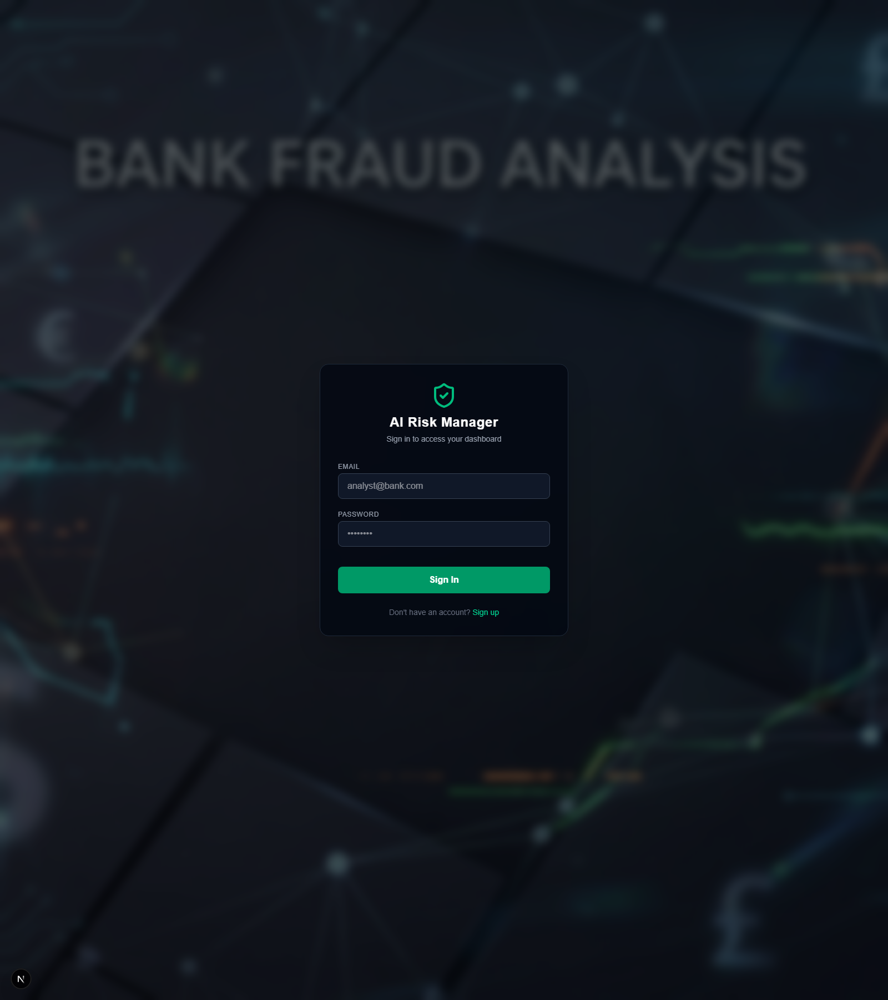
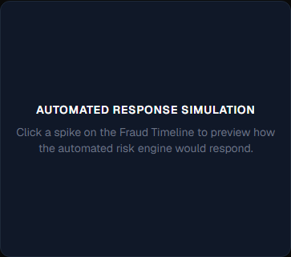
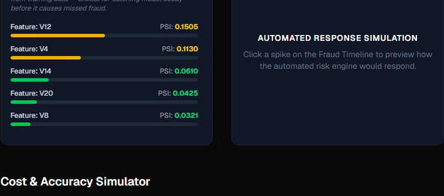
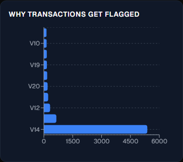
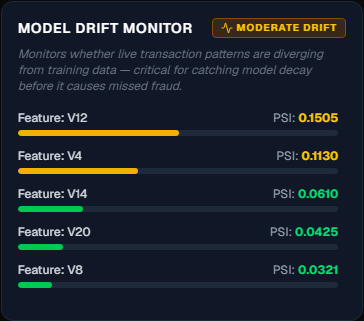
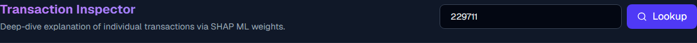

# Fraud Spike Detector & Response Dashboard

An advanced, end-to-end MLOps pipeline and interactive telemetry dashboard designed for real-time anomaly tracking, model decision explainability, and automated defense simulation in banking environments.

## Why This Wins

1. **Cost-Based Threshold Optimization**: Standard ML relies strictly on accuracy, often missing the broader business context. This system actively tunes the model’s operating threshold by modeling exact financial costs ($10,000 penalty per false negative versus $50 operating cost per false positive verification) to compute the actual lowest-cost operating point.
2. **Time-Based Context Strategy**: Time-series credit card fraud datasets suffer from future-leakage if trained randomly. This architecture strictly sorts and truncates temporal data into continuous train/test chronologies, validating model efficacy in live conditions.
3. **Live Interactive Analysis**: Operators slide confidence thresholds in real-time. Impact stats dynamically react without refreshing, instantly revealing the business cost of being too strict or too lenient.
4. **Real-Time Spike Detection**: Instead of just operating per transaction, the pipeline groups flows into localized time windows, computing trailing Z-scores. Severe deviations from trailing rolling averages trigger automated timeline alerts in real-time.

## Architecture Overview
The system heavily adheres to a modern decoupling structure:
* **Backend (FastAPI)**: Heavy statistical aggregation engine, handling localized thresholds, anomaly distribution bucket mathematics, and data fetching dynamically off PostgreSQL logic.
* **Database (PostgreSQL via Neon)**: Relational tables structure the raw transactions and the offline model’s pre-calculated prediction telemetry matrices.
* **Dashboard (Next.js & TailwindCSS)**: Dark-themed, responsive React telemetry board featuring dynamic DOM charting components like `recharts` for rich analytical observability.
* **Machine Learning**: Primary offline capabilities are powered via standard XGBoost (Gradient Boosting), analyzed continuously against strict temporal drift variables.

---

## Complete Feature Matrix

### 1. Overall Risk Grade
A composite grading engine merging model precision, recall capability, model drift integrity, and environmental spike volatility into a single, highly readable health heuristic.


### 2. Live Fraud Timeline
Operates by bucketing high-volume transactions into 10-minute micro-intervals, aggressively calculating rolling bounds. It physically raises Z-score alert flags the exact second volume breaks strict statistical boundaries. 



### 3. Automated Action Simulation
Whenever analysts select an anomalous spike, the backend calculates the scale of the deviation and simulates precise tiered defense recommendations (e.g., initiating global Step-Up OTP verifications). 



### 4. Cost-Aware Threshold Tuning
Enables live sliding of the probability acceptance threshold to dynamically observe the real financial impact of prediction boundaries shifting dynamically against the Confusion Matrix. 



### 5. Explainability Panel
Integrates holistic offline analysis rendering the macro features dominating the model's structure, allowing compliance officers to verify no protected markers govern transaction outcomes.



### 6. Model Drift Monitor
Compares the Population Stability Index (PSI) distributions spanning training distributions versus raw production ingestion patterns, preventing model degradation before it begins.



### 7. Per-Transaction Lookup
Performs deep-level single-event inspection. Deploys unified SHAP computations mapping exactly which vectors contributed (both positive tracking and negative validation) toward the core ML engine’s final probability yield.



### 8. Sign In / Security Gateway
A seamless client-side verification gate designed purely for isolated role-based rendering contexts (this operates strictly in a cosmetic UI presentation mode for demonstration limits).


---

## Live System Telemetry
*Based on the baseline optimal threshold of `0.65` computed within `metrics.json` over strict validation runs.*

* **Precision**: `90.47%` (Heavy resilience against false positives)
* **Recall**: `76.0%` (Vast majority extraction without overwhelming capacity)
* **F1 Score**: `0.826` (Solidly balanced harmonization)
* **PR-AUC**: `0.805` (Excellent extraction strength over highly imbalanced thresholds)
* **Financial Overhead Risk**: Minimum operating cost computed firmly at **`$90,300`**

---

## Defense-Only Compliance Notice
> **[IMPORTANT]**
> This system is structurally isolated and explicitly designed entirely as a **DEFENSIVE only** environment. It solely leverages monitoring telemetry, isolated detection boundaries, and secondary-layer alert tracking. **Absolutely no routines exist within the codebase to generate, weaponize, deploy, or facilitate malicious transaction manipulation.** Automated Action plans strictly suggest internal defensive protocols such as "Trigger Step-Up OTP Verification."

---

## Setup & Deployment

### 1. Requirements
* Internal `.env` mappings mapping Neon PostgreSQL `DATABASE_URL` for the FastAPI backend context.
* Secondary `.env.local` pointing purely to `NEXT_PUBLIC_API_URL` within the Dashboard frontend.

### 2. Standup Protocol
```bash
# Backend Launch Protocol
cd api
pip install -r requirements.txt
python apply_schema.py 
python populate_db.py
uvicorn main:app --port 8888 --reload

# Dashboard Launch Protocol
cd dashboard
npm install
npm run dev
```

### 3. Tech Stack
* Python 3.9+
* FastAPI & Uvicorn
* Neon PostgreSQL (Cloud RDMS)
* Next.js (App Router Protocol)
* React 18, Tailwind CSS, Recharts
* XGBoost & SHAP 
