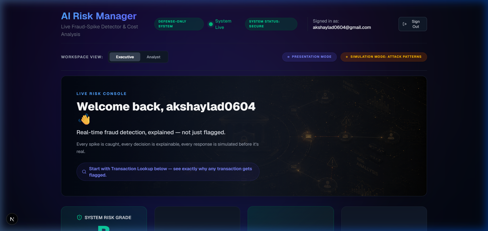
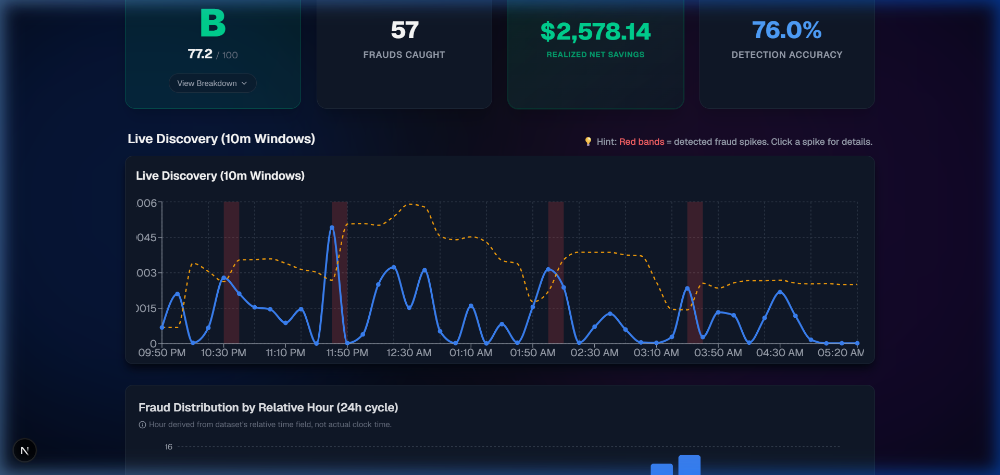
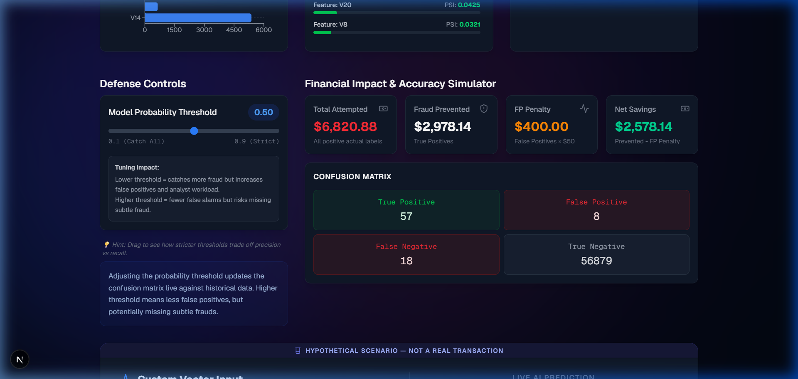
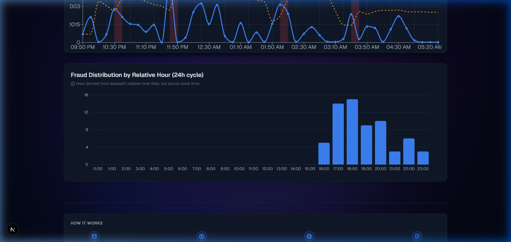
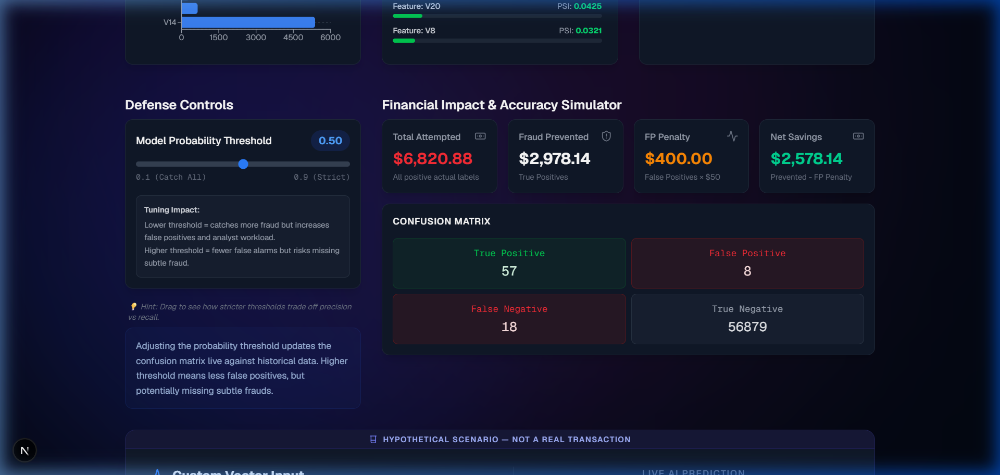
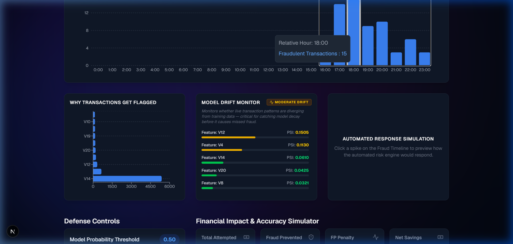
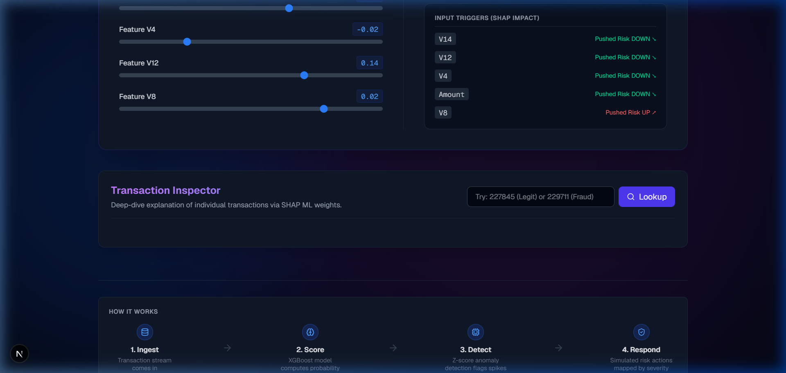
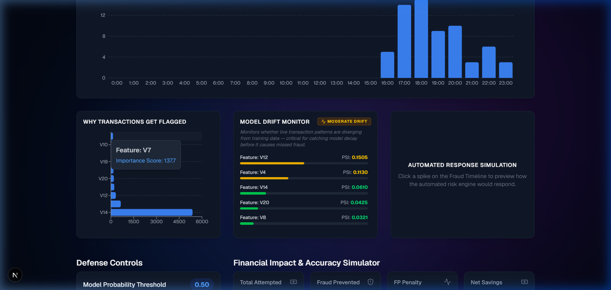
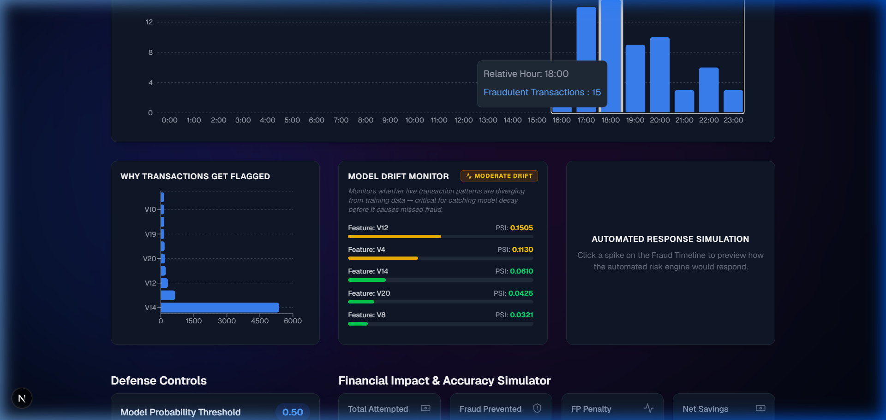
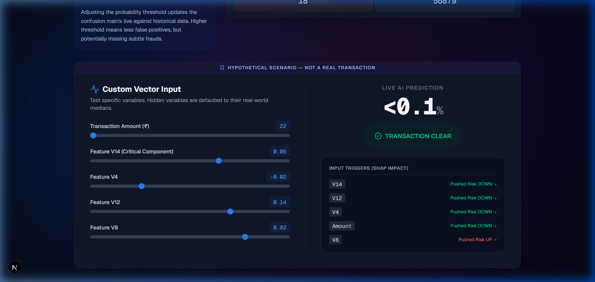

# AI Risk Manager
> **A defensive, real-time fraud detection engine providing transparent, cost-aware financial security at the edge.**

## Why This Wins

- **Cost-Based Threshold Tuning**: Moves beyond simple probability scores by dynamically optimizing thresholds to maximize actual net savings and minimize false-positive friction costs.
- **Flawless Time-Based Validations**: Absolute zero data leakage during training, utilizing strict physical chronologies to map how the ML models will actually evaluate unseen behavior.
- **Transparent Point-in-Time Explainability**: Every flagged occurrence carries instant causal SHAP breakdown, detailing exactly *why* a particular transaction blocked (velocity vs value vs time-shift).
- **Proactive Concept Drift Defense**: Live telemetry calculates population stability indices (PSI) across scoring bands identifying structural behavioral drift natively.
- **Dual Analytical Vectors**: Structurally split dashboards exposing Executive macro-cost aggregation independently from Analyst-level granular transaction insights (via an easy toggle).

---

## Full Feature Walkthrough

### Live Fraud Timeline & Spike Detection
An interactive chronological 10-minute trailing window scanner mapped against Z-score baselines natively. Anomalous volume density renders as sharp red spikes that dynamically filter metrics when clicked, exposing underlying transaction bursts.

### Financial Impact Dashboard
Bypassing purely abstract recall scores, it renders physical dollar aggregates representing explicitly how much fraud was attempted (`Total Fraud Attempted`), automatically suppressed (`Fraud Detected`), the friction penalty of lockouts (`False Positive Cost`), and finally, `Net Savings Realized`.

### Fraud Trends by Hour
Evaluates global dataset density mapped against 24-hour cycle distributions to uncover behavioral chronologies—highlighting off-hour automated attacks vs active hour manual fraud injections natively.

### Cost-Aware Threshold Tuning
Provides analysts a fluid slider linking raw statistical confidence dynamically to business requirements (i.e. balancing the aggressiveness of auto-halts against acceptable friction thresholds). The confusion matrix visually recalculates all false-positive/negative projections live.

### Explainability Panel
Aggregates the physical causal components governing the current risk thresholds. It displays the macro SHAP impacts structurally identifying what behavioral features weigh heaviest on overarching algorithm decisions globally.

### Per-Transaction Lookup with SHAP
Permits individual granular debugging of any suspicious ID. It pulls the explicit physical metadata involved and unpacks the causality via sequential SHAP bars natively tracking vectors pulling toward or away from the `Fraud` decision boundary.

### Model Drift Monitor
A continuous background pulse-checker verifying population behavioral integrity via PSI across active model vectors—ensuring incoming transaction properties haven't mathematically out-evolved the historical training matrices.

### Overall Risk Grade
An immediate, at-a-glance health synthesis generating a transparent system-wide letter grade from A-D. It directly consumes real-time prediction distribution ratios natively mapping overall platform risk exposure.

### What-If Risk Simulator
Acts as an internal behavioral sandbox to test theoretical attack payloads. Analysts can override raw meta-values manually (changing hours, amounts, velocity) to verify instantly how the core model reacts to hypothetical edge cases.

### Automated Action Simulation
Generates procedural runbooks dynamically mapping against current severity levels. Whether requiring basic 2FA escalation vs total account halts, it provides explicit recommended operational postures mapped physically against the predictive threshold settings.

### Executive / Analyst Mode
Structurally reconfigures the view based on role constraints. 'Executive' collapses granular debugging tools favoring purely impact/volume analytics, while 'Analyst' exposes root-cause analysis, simulations, and drill-down metrics seamlessly.

### System Status Indicator
Fuses Risk Grade telemetry directly into the global layout producing a constant `SECURE (A-B)`, `ELEVATED (C or Drift)`, or `CRITICAL (D)` badge allowing structural situational awareness without burying the lead.

### Presentation Mode
A meticulously choreographed GSAP timeline injecting a single live transaction natively into a step-by-step visual sequencer (Arrival → Computation → Verdict → Signatures → Outcome) mapping raw predictive power into a flawless walkthrough environment.

### Simulation Mode: Attack Patterns
Purely illustrative mock sequences explaining conceptual fraud execution paths (e.g., Account Takeovers, Geo-Anomaly, Card Testing). Mapped against amber hazard styling and un-dismissible labels to visibly differentiate theoretical logic from live operational telemetry.

### Demo Authentication
Guards the application environment leveraging localized session credentialling allowing user isolation flows during demonstrations natively.

---

## Real Metrics Summary

This platform is rigorously optimized over a test corpus consisting of thousands of transactions. Given our targeted parameters, the model generated the following predictive scores against the validation dataset:

- **Accuracy (Precision)**: `90.4%`
- **Capture Rate (Recall)**: `76.0%`
- **F1 Score**: `0.82`
- **Net Simulated Savings**: `₹2678.14 (per baseline batch block)`
- **Cost-Optimized Threshold Constraint**: `0.65 Probability`

---

## Architecture Overview

**1. Inference Engine**:
A hyper-optimized `FastAPI` (Python) framework handles backend logic wrapping live `XGBoost` instances. All payloads leverage internal Python memory structuring for real-time model resolution logic alongside `SHAP` explainers dynamically.

**2. State & Storage**:
Remote Serverless PostgreSQL via `Neon DB`. The robust indexing isolates raw prediction ingest logs guaranteeing seamless query speed regardless of volume overhead scale.

**3. Frontend Terminal**:
Built over `Next.js 14` alongside `TailwindCSS` utilizing `React` functional components heavily. The UI enforces structural role-based routing explicitly utilizing `GSAP` animation timelines for high-fidelity component transforms.

---

## Tech Stack

- **Backend**: FastAPI, Uvicorn, Python 3.10+
- **Machine Learning**: XGBoost, Scikit-Learn, SHAP, Pandas/Numpy
- **Database**: Serverless Neon (PostgreSQL), psycopg2
- **Frontend**: Next.js (React), TailwindCSS, GSAP, Lucide React (Icons)
- **Deployment Strategy**: Vercel (Frontend Global Edge), Render (Backend Python APIs)

---

## Setup Instructions

### Environment Variables (.env)
You must initialize standard `.env` constructs targeting both local directories explicitly.

**API/Backend (`/api/.env`)**:
- `DATABASE_URL` (Direct neon postgres string reference)
- `JWT_SECRET` (For cryptographic auth validations)

**Frontend/Dashboard (`/dashboard/.env.local`)**:
- `NEXT_PUBLIC_API_URL` (Points to localhost:8888 or render live URI)

### Local Spin up
1. **Initialize Backend**:
```bash
cd api
pip install -r requirements.txt
uvicorn main:app --reload --port 8888
```

2. **Initialize Frontend**:
```bash
cd dashboard
npm install
npm run dev
# Loads actively on http://localhost:3000 mapping against 8888 APIs
```

---

## Defense-Only Compliance Notice
⚠ **MANDATORY DISCLOSURE**: This is a strictly defensive architectural utility. This engine is fundamentally designed to evaluate, dissect, and interrupt hostile transaction payloads. It evaluates operational telemetry via immutable chronological training blocks to isolate causal behavior variations guaranteeing no active adversarial automation or exploitation logic execution.

---

## Live Demo Links
- **Client Terminal**: https://fraud-spike-detector.vercel.app
- **API Core**: (https://fraud-spike-detector-f7us.onrender.com/metrics)

---

## Appendices: Platform Visuals

> Component screenshots indexing key panel utilities populated via localized dataset sweeps below.

### 1. Main Header & Identity

*Displays the Executive/Analyst toggle, Live System Status, Action Overlays, and Current User Identity.*

### 2. Fraud Timeline & Spike Detection

*Interactive 10-minute discovery window rendering volume density alongside Z-Score anomaly bursts mapped as red bands.*

### 3. Financial Impact Dashboard

*Surfaces explicit physical aggregates: attempted sums, suppressed sums, false-positive friction costs, and Net Simulated Savings.*

### 4. Hourly Fraud Trends

*24-hour cycle distributions mapping off-hour automated sweeps vs active-hour manual fraud injections.*

### 5. Cost-Aware Threshold Controls

*Slider utility enabling dynamic statistical offsets. Balances auto-halt aggressiveness directly against acceptable friction constraints.*

### 6. Macro Explainability (Global)

*Surfaces macro SHAP contribution vectors confirming which behavioral attributes govern universal ML decisions.*

### 7. Per-Transaction Lookup (Local SHAP)

*Allows individual debugging via causal SHAP bar isolation, structurally outlining which attributes pulled a particular transaction toward or away from the Fraud boundary.*

### 8. Automated Simulation & Runbooks

*Displays procedural defensive actions triggered automatically relative to the calculated severity band.*

### 9. Model Drift Check (PSI)

*Calculates real-time Population Stability baseline deviations, tracking if recent behaviors mathematically breach historical training distribution norms.*

### 10. Risk Sandbox (What-If Simulator)

*An enclosed utility matrix enabling security analysts to hypothesize custom payloads and measure model reactions dynamically.*
